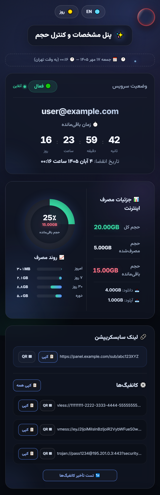
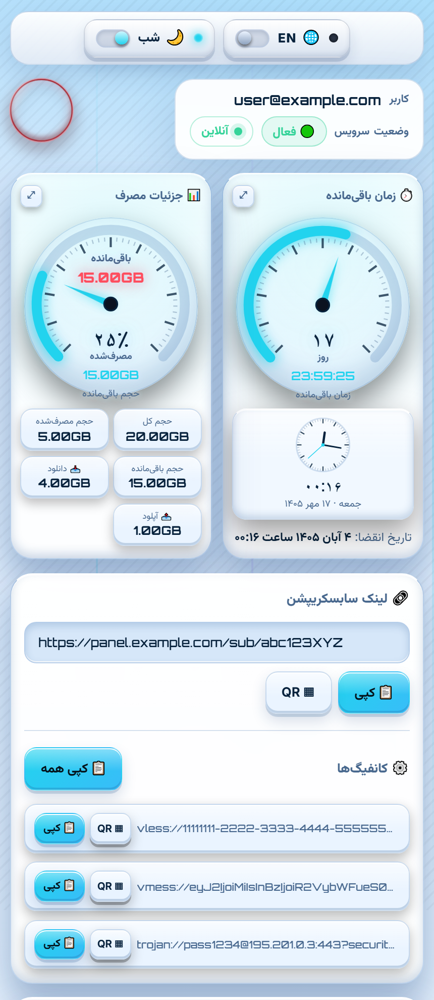
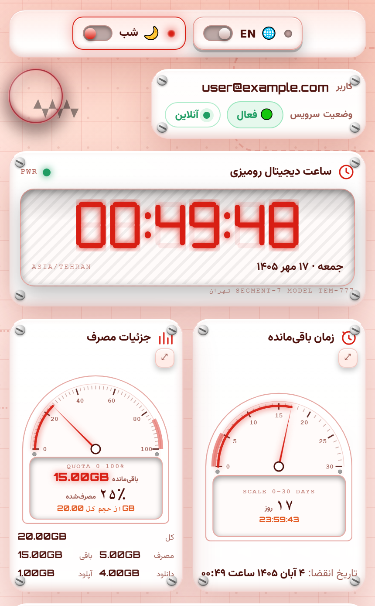

# TEMp — قالب‌های اختصاصی پنل سنایی (3x-ui)

> **English** — see the [English section](#english) below.

این پروژه برای **پنل سنایی** طراحی شده است؛ یعنی همان پنل 3x-ui که سرویس اشتراک VPN شما روی آن اجرا می‌شود. با یک دستور، صفحه اشتراک کاربر با طراحی‌های مدرن این پروژه جایگزین می‌شود.

## ⚡️ نصب — فقط یک دستور

روی سرور اجرا کنید:

```bash
bash <(curl -sL https://raw.githubusercontent.com/amir12120/TEMp/main/install.sh)
```

یک **منوی CLI** باز می‌شود که لیست همه تم‌های موجود را نشان می‌دهد:

```
==============================================
   TEMp — 3x-ui theme installer
   amir12120/TEMp  ·  target: /etc/3x-ui/templates/my-theme/index.html
==============================================

:: Available themes:

  1) modern
  2) speed
  3) electronics

Select theme number [1-3]:
```

عدد تم موردنظر را وارد کنید — همان تم با نام `index.html` در مسیر `/etc/3x-ui/templates/my-theme/` قرار می‌گیرد، پنل ری‌استارت می‌شود و کار تمام است.

همان بار اول، نصاب علاوه بر نصب تم، دستور `temp` را هم می‌سازد. یعنی از این به بعد **برای تعویض تم نیازی نیست دوباره کد نصب را وارد کنید** — کافی است `temp` را بنویسید.

## 🔁 تعویض تم با دستور `temp`

```bash
temp            # منوی تم‌ها را باز می‌کند؛ تم فعال با «* active» مشخص است
temp speed      # مستقیم یک تم را نصب و فعال می‌کند
temp list       # فقط لیست تم‌ها را نشان می‌دهد
sudo temp speed # اگر به پوشهٔ قالب دسترسی نوشتن ندارید
```

نکته‌ها:

- تم انتخابی مثل بار اول بکاپ زمان‌دار می‌گیرد، اتمی جایگزین می‌شود و پنل ری‌استارت می‌شود.
- هر بار که `temp` را اجرا می‌کنید، آخرین نسخهٔ `install.sh` از گیت‌هاب گرفته می‌شود؛ پس **تم جدیدی که بعداً به ریپو اضافه شود خودکار در منو ظاهر می‌شود**.
- اگر اینترنت نباشد، از نسخهٔ کش‌شدهٔ نصاب استفاده می‌شود.
- اگر `/usr/local/bin` قابل نوشتن نباشد (مثلاً بدون `sudo` نصب کرده باشید)، نصب تم انجام می‌شود ولی دستور `temp` ساخته نمی‌شود؛ در آن صورت همان دستور نصب را یک‌بار با `sudo` اجرا کنید.
- مسیر پوشهٔ قالب و محل ساخت دستور قابل تغییر است: `TEMP_TARGET_DIR`، `TEMP_BIN_PATH`، `TEMP_STATE_DIR`.

## ⚙️ نکته مهم — تنظیم پنل سنایی (بعد از نصب الزامی است)

برای اینکه پنل قالب جدید را بشناسد، در خود پنل سنایی مسیر قالب را معرفی کنید:

1. وارد پنل سنایی شوید.
2. به قسمت **تنظیمات پنل** بروید.
3. تب **سابسکریپشن** را باز کنید.
4. بخش **پروفایل** را پیدا کنید.
5. در قسمت **«پوشه قالب صفحه اشتراک»** عبارت زیر را وارد کنید:

   ```
   /etc/3x-ui/templates/my-theme/
   ```

6. **ذخیره** کنید.

از این پس صفحه اشتراک کاربران از قالب نصب‌شده در این مسیر خوانده می‌شود. (نصاب هم بعد از نصب همین راهنما را نمایش می‌دهد.)

## نصاب چه کاری انجام می‌دهد؟

1. لیست تم‌ها را از `pages.txt` همین ریپو می‌خواند و منو را نمایش می‌دهد.
2. تم انتخابی را از `pages/<name>/index.html` دانلود می‌کند.
3. مسیر `/etc/3x-ui/templates/my-theme/` را در صورت عدم وجود می‌سازد.
4. اگر از قبل `index.html` وجود داشته باشد، از آن **بکاپ زمان‌دار** می‌گیرد (فایل `.bak`) — پس برگشت به تم قبلی همیشه ممکن است.
5. فایل جدید را به‌صورت اتمی جایگزین `index.html` می‌کند.
6. پنل 3x-ui را ری‌استارت می‌کند.
7. نام تم فعال را در `/var/lib/temp-theme/active` ذخیره می‌کند تا در منو با «* active» علامت بخورد.
8. دستور `temp` را در `/usr/local/bin/temp` می‌سازد تا از این به بعد تعویض تم بدون وارد کردن دوبارهٔ کد نصب انجام شود.

## صفحه‌های موجود

| صفحه     | توضیح |
|----------|-------|
| `modern` | صفحه اشتراک مدرن — دو زبانه (فارسی/انگلیسی)، حالت شب و روز، QR کد برای تک‌تک کانفیگ‌ها، اندازه‌گیری تأخیر ترنسپورت‌های HTTP از مرورگر، نشانگر آنلاین/آفلاین زنده، ساعت تهران با رویدادهای تقویم ایرانی، بخش دانلود اپلیکیشن (۹ برنامه با لینک آخرین نسخه — برای v2rayNG حتی نسخه‌های pre-release) |
| `speed`  | داشبورد اسپرت «کیلومتر و دور موتور» — دو گیج عقربه‌ای (زمان باقی‌مانده روی **مقیاس ثابت ۳۰ روزه** — عقربه تا وقتی بیش از ۳۰ روز باقی است روی «پر» می‌ماند و بعد کم‌کم به صفر و رنگ قرمز می‌رسد، به‌همراه جزئیات مصرف با **حجم باقی‌ماندهٔ قرمز چشمک‌زن با برچسب «باقی‌مانده» در وسط نیمهٔ بالایی صفحهٔ گیج**) که **همیشه کنار هم** می‌مانند و روی موبایل هم با یک ضربه **بزرگ و خوانا** می‌شوند و با ضربه‌ی بعدی سر جایشان برمی‌گردند (در حالت بزرگ‌شدهٔ گیج زمان، ساعت تهران کنار می‌رود و فقط **تاریخ انقضا زیر صفحهٔ گیج** می‌ماند)، ساعت گرد به وقت تهران با تاریخ و مناسبت زیر آن، کارت وضعیت سرویس/آنلاین/کاربر در گوشه، کلیدهای زبان و شب/روز به شکل **کلیدهای داشبورد ماشین** در بالاترین نقطهٔ صفحه، لوگوی سکهٔ چرخان (همان تم مدرن)، لینک ساب و کانفیگ‌ها پایین گیج‌ها (روی موبایل هر کانفیگ **در یک خط** مثل تم مدرن، با کلیدهای QR و کپی کنار هم)، بخش **نصب و راه‌اندازی / دانلود برنامه‌ها** که سیستم‌عامل کاربر را خودکار تشخیص می‌دهد و برنامه‌های همان دستگاه را نشان می‌دهد و برای انتخاب دستی هم یک **منوی کشویی** دارد (۹ برنامه، همیشه آخرین نسخه — برای v2rayNG حتی نسخه‌های pre-release)، همهٔ منوها/گیج‌ها/کلیدها/باکس‌ها **برجسته و سه‌بعدی**، و **حالت پیش‌فرض روز + زبان فارسی** |
| `electronics` | تم «میز کار الکترونیک» — ساعت دیجیتال رومیزی **سون‌سگمنت** به وقت تهران با تاریخ (شمسی/میلادی) و مناسبت‌ها زیر آن، دو گیج **نیم‌دایرهٔ مولتی‌متری عقربه‌ای** که **همیشه کنار هم** هستند و با یک ضربه بزرگ و خوانا می‌شوند: گیج زمان روی **مقیاس ۳۰ روزه** (تا وقتی بیش از ۳۰ روز مانده عقربه روی ۳۰ منتظر می‌ماند و بعد کم می‌شود) و گیج مصرف با **حجم باقی‌ماندهٔ قرمز چشمک‌زن داخل صفحهٔ گیج** و **درصد مصرف‌شده زیر آن**؛ زیر آن دو، **نمودار مصرف ساعتی/روزانه/هفتگی** (از نمونه‌های شمارندهٔ پنل ساخته می‌شود)، اخطار تمدید وقتی کمتر از **یک روز** یا **یک گیگ** مانده، کلیدهای شب/روز و زبان در بالاترین نقطهٔ صفحه، لوگو/کاربر/وضعیت سرویس با نشانگر آنلاین-آفلاین (مثل تم‌های قبلی)، لینک ساب با QR و کپی، کانفیگ‌ها هر یک **در یک خط** با کلیدهای QR و کپی **زیر هم در یک ستون** به‌همراه دکمهٔ «کپی همه»، بخش **نصب و راه‌اندازی / دانلود برنامه‌ها** با تشخیص خودکار دستگاه (همان ۹ برنامه و همان قوانین دو تم قبلی)، همهٔ بخش‌ها با **ظاهر برد مدار چاپی، پیچ، صفحهٔ فلزی و صفحهٔ نمایش LCD** — و **حالت روز قرمز** با پیش‌فرض **روز + فارسی** |

<a id="fa-screenshots"></a>
## 📸 اسکرین‌شات تم‌ها

تصاویر زیر از **خود تم‌ها** و با دادهٔ نمونه گرفته شده‌اند — روی هر تصویر بزنید تا در اندازهٔ کامل باز شود (تصویر کل صفحه: [`modern`](screenshots/modern.png) · [`speed`](screenshots/speed.png) · [`electronics`](screenshots/electronics.png)):

| `modern` — پیش‌فرض شب | `speed` — پیش‌فرض روز | `electronics` — پیش‌فرض روز |
|:---:|:---:|:---:|
| [](screenshots/modern.png) | [](screenshots/speed.png) | [](screenshots/electronics.png) |

این تصاویر دستی گرفته نشده‌اند: اسکریپت `screenshots/make-screenshots.mjs` جای‌نگهدارهای Go را با دادهٔ نمونه پر می‌کند و با کروم بی‌سر (headless) از هر تم اسکرین‌شات می‌گیرد. بعد از هر تغییر در تم‌ها یا اضافه‌کردن تم جدید، یک‌بار اجرا کنید و تصاویر تازه را کامیت کنید (روی سیستم باید Chrome یا Edge نصب باشد):

```bash
node screenshots/make-screenshots.mjs                 # همهٔ تم‌های pages.txt
node screenshots/make-screenshots.mjs modern --day    # یک تم، در حالت روز
node screenshots/make-screenshots.mjs speed --night   # یک تم، در حالت شب
node screenshots/make-screenshots.mjs electronics     # تم الکترونیک (پیش‌فرض روز)
```

## افزودن تم جدید در آینده

1. پوشه جدید بسازید: `pages/<name>/index.html` (نام فقط حروف، عدد، `-` و `_`).
2. نام آن را یک خط به `pages.txt` اضافه کنید.
3. اسکرین‌شات تم را بسازید:

   ```bash
   node screenshots/make-screenshots.mjs <name>
   ```

   دو فایل ساخته می‌شود: `screenshots/<name>.png` (کل صفحه) و `screenshots/<name>-top.png` (برشی که در README نمایش داده می‌شود).
4. تم را به جدول اسکرین‌شات‌ها بالا اضافه کنید و هر دو تصویر را کامیت کنید.
5. کامیت و پوش کنید — منوی نصاب به‌صورت خودکار آن را نشان می‌دهد و نیازی به تغییر اسکریپت نیست.

## ساختار ریپو

```
TEMp/
├── install.sh          # نصاب با منوی تعاملی + ساخت دستور temp
├── pages.txt           # لیست تم‌های موجود (هر نام یک خط: modern، speed، electronics)
├── pages/
│   ├── modern/
│   │   └── index.html  # تم مدرن
│   ├── speed/
│   │   └── index.html  # تم اسپرت کیلومتر
│   └── electronics/
│       └── index.html  # تم میز کار الکترونیک
└── screenshots/        # اسکرین‌شات تم‌ها + اسکریپت ساخت آن‌ها
    ├── make-screenshots.mjs  # ساخت خودکار تصاویر از تم‌ها
    ├── modern.png            # تم مدرن — کل صفحه
    ├── modern-top.png        # تم مدرن — برش README
    ├── speed.png             # تم اسپرت — کل صفحه
    ├── speed-top.png         # تم اسپرت — برش README
    ├── electronics.png       # تم الکترونیک — کل صفحه
    └── electronics-top.png   # تم الکترونیک — برش README
```

---

<a id="english"></a>
## English

Custom subscription-page themes for the **Senai panel** (MHSanaei's 3x-ui fork). One single
command opens an interactive CLI menu of every theme in this repo; picking a number installs
it as the panel theme.

### Install

```bash
bash <(curl -sL https://raw.githubusercontent.com/amir12120/TEMp/main/install.sh)
```

The installer:

1. Lists all themes from `pages.txt` in a numbered menu.
2. Downloads the chosen theme from `pages/<name>/index.html`.
3. Creates `/etc/3x-ui/templates/my-theme/` if missing.
4. **Backs up** any existing `index.html` (timestamped `.bak`) — the previous theme is never lost.
5. Atomically replaces `index.html` and restarts the 3x-ui panel.
6. Records the active theme in `/var/lib/temp-theme/active` so the menu can mark it with `* active`.
7. Installs a `temp` command at `/usr/local/bin/temp`.

### Switching themes later — the `temp` command

```bash
temp            # opens the theme menu; the active theme is marked with * active
temp speed      # installs that theme directly, no menu
temp list       # just prints the available theme names
sudo temp speed # if you lack write access to the theme folder
```

- The chosen theme is backed up, atomically swapped in and the panel is restarted, exactly like the one-liner install.
- `temp` always re-fetches the newest `install.sh` from GitHub, so **themes added to the repo later show up in the menu automatically**; when GitHub is unreachable it falls back to a cached copy.
- If `/usr/local/bin` is not writable (e.g. you installed without `sudo`) the theme is still installed but the `temp` command is skipped — run the one-liner install once with `sudo` to get it.
- Overridable via env vars: `TEMP_TARGET_DIR`, `TEMP_BIN_PATH`, `TEMP_STATE_DIR`.

### Required panel setting (after install)

In the panel: **Panel Settings → Subscription → Profile → "Sub Theme Directory"** — enter:

```
/etc/3x-ui/templates/my-theme/
```

and **Save**. The subscription page now renders from this folder.

### Available themes

| Theme    | Description |
|----------|-------------|
| `modern` | Modern bilingual (fa/en) subscription & usage panel — dark/light modes, per-config QR codes, browser latency measurement for HTTP transports, live online/offline presence, Tehran clock with Iranian-calendar events, app download section (9 apps, always the newest release; v2rayNG includes pre-releases) |
| `speed`  | Sporty car-dashboard (speedometer/tachometer) theme — two needle gauges (time remaining on a **fixed 30-day scale** — the needle waits at “full” while more than 30 days are left, then counts down to zero and turns red, plus usage details with the **remaining quota blinking in red under a “Remaining” label in the middle of the upper half of the dial**) that always sit **side by side** and blow up to a readable size on tap (tap again to put them back — in the enlarged time gauge the Tehran clock steps aside and only the **expiry date under the dial** remains), round Tehran clock with date and occasion beneath it, service status/online/user card in the corner, language and day/night controls styled as **car-dashboard rocker switches** at the very top, the modern theme's spinning coin logo, sub link and configs below (on phones each config stays on **one line** like the modern theme, with the QR and copy buttons inline), and an **install & setup / app-download section** that auto-detects the visitor's OS, lists that device's apps and still offers a **dropdown** for manual picks (9 apps, always the newest release; v2rayNG includes pre-releases), every menu/gauge/button/box **embossed and 3D**, and **day mode + Persian as the defaults** |
| `electronics` | “Electronics bench” theme — a seven-segment **desk clock** showing Tehran time with the Jalali/Gregorian date and Iranian-calendar occasions beneath it, two **half-round needle multimeter dials** that always sit **side by side** and enlarge on tap: the time dial runs on a **30-day scale** (the needle waits at 30 while more than 30 days are left, then falls back) and the usage dial carries the **remaining quota blinking in red on the dial face with the used percentage printed under it**; below the dials sit **hourly / daily / weekly usage charts** (built from samples of the panel counter), renewal warnings appear when under **one day** or **one gigabyte** is left, day/night + language switches at the very top, the same logo / user / service-status card with live online-offline presence, the sub link with QR and copy, configs **one line each** with their QR and copy buttons **stacked in a single column** plus “copy all”, an **install & setup section** that auto-detects the device (same nine apps and the same rules as the two themes above), every panel dressed as **PCB / screwed metal faceplate / LCD hardware** — a **red day mode**, and **day + Persian defaults** |

### Screenshots

Every theme is screenshotted with sample data — click an image for the full-size PNG (full pages: [`modern`](screenshots/modern.png), [`speed`](screenshots/speed.png), [`electronics`](screenshots/electronics.png)):

| `modern` — night (default) | `speed` — day (default) | `electronics` — day (default) |
|:---:|:---:|:---:|
| [](screenshots/modern.png) | [](screenshots/speed.png) | [](screenshots/electronics.png) |

Those images come straight from the themes: `screenshots/make-screenshots.mjs` fills the Go-template placeholders with sample data and takes a headless-Chrome screenshot. Re-run it whenever a theme changes and commit the updated files (Chrome or Edge required):

```bash
node screenshots/make-screenshots.mjs                 # every theme in pages.txt
node screenshots/make-screenshots.mjs modern --day    # one theme, day mode
node screenshots/make-screenshots.mjs speed --night   # one theme, night mode
node screenshots/make-screenshots.mjs electronics     # electronics theme (day default)
```

### Adding a new theme

1. Create `pages/<name>/index.html` (the name may hold letters, digits, `-` and `_`).
2. Add the name as a line in `pages.txt`.
3. Generate its screenshots:

   ```bash
   node screenshots/make-screenshots.mjs <name>
   ```

   This writes `screenshots/<name>.png` (full page) and `screenshots/<name>-top.png` (the crop shown above).
4. Add the theme to the [Screenshots](#screenshots) table above.
5. Commit and push both images — the installer menu picks the theme up automatically and the script itself never needs changing.
